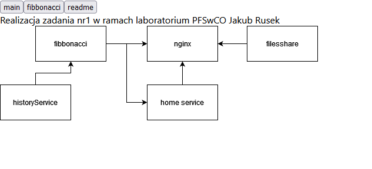
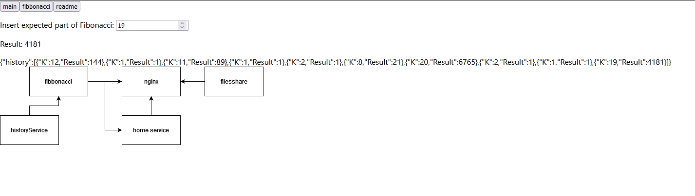
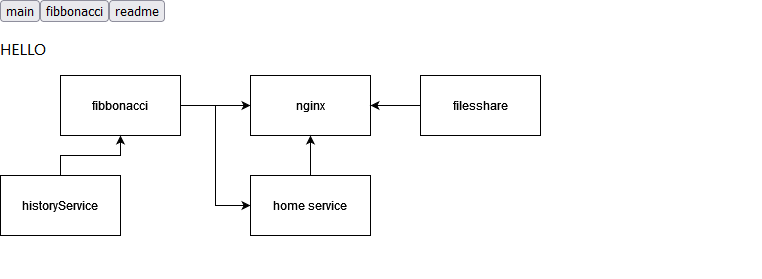

# Link do repo
https://github.com/IRusio/PFSwChO2021/tree/master/zad1

# Wstep
calosc uslugi jest opakowana w docker-compose, wiec komenda do uruchomienia:
docker-compose up -d 

# Opis Architektury
mamy 5 serwisów:
 - nginx: nignx zarządzanie routingiem aplikacji
 - filessahre: fastapi(python) => aplikacja do udostępniania statycznych plików
 - historyService: .net 5 - prosty serwis REST'owy do przechowywania danych
 - homeService: react - strona główna, naszykowana pod mikro frontend
 - fibbonacci: react - mikro frontend, w którym mamy obliczenia itd.

# Podsumowanie
ogólnie podsumowywując rozbudowanie serwisów o kolejny, 6 serwis nie sprawiałoby raczej większych problemów, a opcji które by na to pozwalało jest kilka: takich jak baza danych, dodatkowy serwis do współdzielenia zdjęć, bądź też naszykowanie kolejnego mikrofrontendu do wyświetlania readme ;) 

